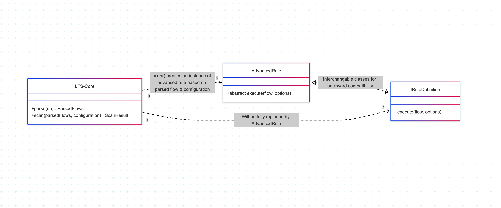

# Writing Custom Rules



The Lightning Flow Scanner (LFS) core provides two primary capabilities: `parse` and `scan`.

- **Parse**: Accepts a URI, file path, or location, and processes the flow definition. Parsing goes beyond simple XML-to-JSON translation by classifying and structuring the flow data into meaningful objects for further analysis.
- **Scan**: Takes a parsed flow and applies a set of defined rules. Each rule is instantiated and executed according to the provided configuration.

Rules in LFS are implemented as classes that conform to the `IRuleDefinition` interface, ensuring each rule exposes the required properties and methods for the scanner to recognize and execute them.

> **Important:** Custom rules are recognized by the Lightning Flow Scanner only if your rule configuration in the flow-scanner config file specifies a valid `path` to the rule implementation. Ensure that each custom rule entry includes the `path` property pointing to the JavaScript file that exports your rule class.
```yml
rules:
  MyCustomRuleToBeScanned:
    path: # Relative or absolute path to js file
    severity: error
```

> **Note:** The `IRuleDefinition` interface is being replaced by the `AdvancedRule` base class. This transition allows backward compatibility, simplifies rule development and enables exception handling at the flow scan process level. Additionally, the introduction of `AdvancedSuppression` allows individual rules to define custom suppression logic, providing more granular control over rule enforcement.

## Rule Structure 
A custom rule class typically follows this structure:

```typescript
// Import necessary types and classes from a local core module
import { Flow, FlowAttribute, FlowType, AdvancedRule, ResultDetails, RuleResult } from 'lightning-flow-scanner-core';

export class CustomNamingConvention extends AdvancedRule {

  constructor(){
    super({
      name: 'CustomNamingConvention',
      label: 'Custom Naming Convention',
      description: 'custom execute function ',
      type: 'flow',
      supportedTypes: FlowType.allTypes(),
      isConfigurable: true;
    },
    { severity: "error" });
  }

  // Create custom execute logic
  public execute(flow: Flow, options?: { expression: string }): RuleResult {
    
    const conventionApplied = (flow.name)?.startsWith('AcmeCorp_]');
    return (!conventionApplied ?
      new RuleResult(this, [new ResultDetails(new FlowAttribute(flow.name, 'name', 'The Name needs to start with AcmeCorp_'))]) :
      new RuleResult(this, []));
  }
}

```

In this code:
- We're importing necessary types and classes from the local core repository using a relative path (./lightning-flow-scanner-core/src/index). Make sure to adjust the path according to your local Core Module.
- We're defining the CustomNamingConvention class, implementing the IRuleDefinition interface.
- We're setting up the class properties such as name, label, description, etc., as per your provided example.
- We're implementing the execute method, which performs the custom logic for your rule. This method takes a Flow object as input and returns a RuleResult.

## Custom Rule Interface

When creating custom rules, it's essential to adhere to the IRuleDefinition interface, which defines the required properties and methods for a rule definition:

```typescript
export interface IRuleDefinition {
  name: string;
  label: string;
  description: string;
  supportedTypes: string[];
  type: string;
  docRefs: { label: string, path: string }[];
  isConfigurable: boolean;
  uri?: string;
  severity?: string;

  execute(flow: Flow, ruleOptions?: {}): RuleResult;
}
```

## Flow Compiler
The Flow Compiler is a powerful tool provided by the Lightning Flow Scanner Core for creating custom rules that require traversal of flow elements. This compiler enables efficient traversal through flow elements and is particularly useful for implementing complex logic for rule enforcement.

### Compiler Overview:
The Compiler class consists of methods designed to traverse flow elements effectively:
- Constructor: Initializes the visitedElements set, which keeps track of visited elements during traversal.
- traverseFlow Method: Implements the Iterative Deepening Depth-First Search (IDDFS) algorithm for traversing flow elements. It iteratively explores each element, starting from a specified starting point, and visits each element by calling the provided callback function. The traversal continues until all elements are visited or until a specified end point is reached.
- findNextElements Method: This private method is used internally by the traverseFlow method to find the next elements to visit based on the connectors of the current element. It examines the connectors of the current element and identifies the next elements to traverse.

### Example Rule Using the Compiler:
```typescript
// Import the Compiler class
import Compiler from 'path/to/your/local/core/module';

// Assume we have a custom rule that checks for the presence of certain elements in the flow
// We'll define a custom rule class with an execute method that utilizes the Compiler to traverse through flow elements

export class CustomRuleExample implements IRuleDefinition {

  constructor() {
    // Constructor logic
  }

  // Define the execute method to perform custom logic
  public execute(flow: Flow): RuleResult {
    const compiler = new Compiler(); // Initialize the compiler

    // Callback function to be executed on each visited element
    const visitCallback = (element: FlowNode) => {
      // Check if the current element meets certain conditions
      if (element.subtype === 'screen') {
        // Perform custom logic based on the element type
        console.log(`Found a screen element named ${element.name}`);
        // Add the element to the result or perform other actions
      }
    };

    // Start traversing the flow from a specific starting element
    // In this example, we'll start from the first element
    compiler.traverseFlow(flow, flow.elements.name, visitCallback);

    // Return the result of the rule execution
    return new RuleResult(this, []); // Assume no violations found for simplicity
  }
}
```

In this example:
- We first import the Compiler class.
- We define a custom rule class CustomRuleExample with an execute method.
- Inside the execute method, we initialize a new instance of the Compiler.
- We define a callback function visitCallback that is executed on each visited element. In this example, we check if the element subtype is a screen and perform custom logic accordingly.
- We call the traverseFlow method of the compiler to start traversing the flow from the first element (flow.elements.name) and provide the visitCallback function.
- Inside the visitCallback function, we perform custom logic based on the visited elements.
- Finally, we return the result of the rule execution.